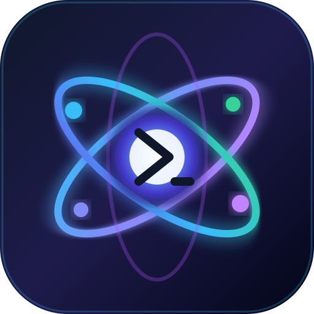

# Google Antigravity CLI on Unraid & Docker

<p align="center">
  
</p>

<p align="center">
  <strong>Run Google Antigravity CLI as an autonomous AI coding agent directly on your Unraid server or Docker host.</strong>
</p>

<p align="center">
  <a href="https://github.com/hoveeman/antigravity-cli-docker/actions"></a>
  <a href="https://hub.docker.com/r/hoveeman/antigravity-cli"></a>
  <a href="https://github.com/hoveeman/antigravity-cli-docker/blob/main/LICENSE"></a>
  
  
</p>

---

## Highlights

- **Headless & Autonomous**: Runs Google's official Antigravity CLI (`agy`) as a background daemon on your Unraid server or NAS.
- **Unraid Optimized**: Native `PUID=99` and `PGID=100` (`nobody:users`) permission mapping ensures files created or edited by the agent on your Unraid shares never trigger permission errors.
- **Always Up to Date**: Automatically queries Google's release manifest on startup and periodically in the background, updating the `agy` flat binary seamlessly.
- **Full Developer Toolchain**: Pre-equipped with Node.js 22 LTS, Python 3, pip, python-venv, Git, build-essential (gcc, g++, make), jq, curl, and the Docker CLI.
- **Persistent State**: OAuth tokens (`.gemini/`), preferences, SSH keys, and bash history are safely isolated in `/config` (mapped to `/mnt/user/appdata/antigravity`).
- **Antigravity Remote**: Seamlessly connect from the Antigravity Desktop App or Web UI and dispatch tasks directly to your Unraid server.

---

## Why Docker on Unraid?

Installing Antigravity directly on bare-metal Unraid via terminal is strongly discouraged:
1. **Unraid runs in RAM (`tmpfs`)**: Everything installed to `/usr/local/bin` or `~/.local/bin` is lost upon reboot.
2. **No `systemd` on Unraid host**: Unraid uses Slackware BSD init scripts. The background daemon (`agy remote-control start`) relies on Linux user services that do not run on bare-metal Unraid.
3. **Array Security**: Antigravity is an autonomous agent executing shell commands. Running inside a Docker container isolates it from your raw disk partitions (`/mnt/disk*`), USB boot flash drive (`/boot`), and Unraid management services (`emhttpd`).
4. **Developer Dependencies**: The base Unraid NAS OS intentionally omits compilers, runtimes, and build tools needed by coding agents.

---

## Deployment Methods

### Method 1: Unraid Community Applications (XML Template)

1. In the Unraid WebGUI, navigate to the **Docker** tab.
2. Under **Template Repositories**, add:
   ```
   https://github.com/hoveeman/antigravity-cli-docker
   ```
   *(Or download [`templates/antigravity-cli.xml`](templates/antigravity-cli.xml) into `/boot/config/plugins/dockerMan/templates-user/`).*
3. Click **Add Container** and select **Antigravity CLI**.
4. Configure paths:
   - **Appdata / Config**: `/mnt/user/appdata/antigravity` &rarr; `/config`
   - **Projects / Workspaces**: `/mnt/user/projects` &rarr; `/workspaces`
5. Click **Apply**.

---

### Method 2: Docker Compose

If using Unraid's Docker Compose Manager plugin or any Docker host:

```yaml
services:
  antigravity:
    image: hoveeman/antigravity-cli:latest
    container_name: antigravity
    restart: unless-stopped
    stdin_open: true
    tty: true
    environment:
      - PUID=99
      - PGID=100
      - TZ=America/New_York
      - ANTIGRAVITY_INSTANCE_NAME=unraid-server
      - AUTO_START_DAEMON=true
      - AUTO_UPDATE=true
    volumes:
      - /mnt/user/appdata/antigravity:/config
      - /mnt/user/projects:/workspaces
      # Optional Docker socket passthrough:
      # - /var/run/docker.sock:/var/run/docker.sock
```

Run:
```bash
docker compose up -d
```

---

### Method 3: Docker CLI

```bash
docker run -d \
  --name antigravity \
  --restart unless-stopped \
  -e PUID=99 \
  -e PGID=100 \
  -e TZ=America/New_York \
  -e ANTIGRAVITY_INSTANCE_NAME=unraid-server \
  -e AUTO_START_DAEMON=true \
  -e AUTO_UPDATE=true \
  -v /mnt/user/appdata/antigravity:/config \
  -v /mnt/user/projects:/workspaces \
  hoveeman/antigravity-cli:latest
```

---

## Initial Setup & Authentication (One-Time)

Because the container runs headlessly on Unraid without a desktop web browser, follow these steps to authenticate once:

1. **Start the container** in Unraid.
2. In the Unraid WebGUI, click the container icon and select **Console** (or run `docker exec -it antigravity bash`).
3. Run the CLI:
   ```bash
   agy
   ```
4. **Headless OAuth Flow**:
   - `agy` detects the remote/headless shell and outputs a unique Google sign-in URL in your terminal.
   - Copy and paste that URL into a browser on your local computer.
   - Sign in with your Google account.
   - Copy the authentication token / verification code shown in your browser.
   - Paste it back into the Unraid console and press `Enter`.
5. Exit the session (`Ctrl+D` or `/exit`).
6. Register the remote daemon:
   ```bash
   agy remote-control start --name unraid-server --session
   ```
7. Verify status:
   ```bash
   agy remote-control status
   ```

*All tokens and settings are safely persisted in `/config` (`/mnt/user/appdata/antigravity`). You will never need to re-authenticate when recreating or updating the container.*

---

## Connecting via Antigravity Remote

Once authenticated:
1. Open your local **Antigravity Desktop App** or visit the web interface.
2. Navigate to **Remote Control** / **Instances**.
3. Select your instance (e.g. `unraid-server`).
4. All tasks, autonomous subagents, and file edits will execute inside your Unraid container at `/workspaces`!

---

## Configuration Reference

### Environment Variables

| Variable | Default | Description |
|---|---|---|
| `PUID` | `99` | User ID for file ownership inside container (matches Unraid `nobody`). |
| `PGID` | `100` | Group ID for file ownership inside container (matches Unraid `users`). |
| `TZ` | `America/New_York` | Container timezone for logs. |
| `ANTIGRAVITY_INSTANCE_NAME` | `unraid-server` | Instance name displayed in Antigravity Remote. |
| `AUTO_START_DAEMON` | `true` | Automatically starts `agy remote-control` daemon on boot. |
| `AUTO_UPDATE` | `true` | Checks for and installs official Google CLI updates. |
| `UMASK` | `002` | File creation mask. |

### Volume Mounts

| Container Path | Host Path (Unraid) | Description |
|---|---|---|
| `/config` | `/mnt/user/appdata/antigravity` | Persistent home directory (`.gemini/`, `.ssh/`, `.gitconfig`). |
| `/workspaces` | `/mnt/user/projects` | Working directory where code and shares reside. |
| `/var/run/docker.sock` *(Optional)* | `/var/run/docker.sock` | Pass host Docker socket to manage containers from Antigravity. |

---

## Automatic Updates

The container includes a multi-tiered update strategy:
1. **On Boot**: Queries `https://antigravity-cli-auto-updater-974169037036.us-central1.run.app/manifests/linux_<arch>.json` and pulls the latest release tarball directly from Google storage before launching.
2. **Periodic Daemon**: Every 24 hours, checks for upstream releases while the container continues running.
3. **Built-in `agy update`**: You can also run `agy update` inside the console at any time.

---

## Publishing to Docker Hub & GHCR

The repository includes a GitHub Actions workflow (`.github/workflows/docker-publish.yml`) that automatically builds multi-arch images (`linux/amd64` and `linux/arm64`).

### To enable Docker Hub pushes:
1. In your GitHub repository, go to **Settings** &rarr; **Secrets and variables** &rarr; **Actions**.
2. Add the following repository secrets:
   - `DOCKERHUB_USERNAME`: Your Docker Hub username (`hoveeman`)
   - `DOCKERHUB_TOKEN`: A Docker Hub Personal Access Token (created at [hub.docker.com](https://hub.docker.com/settings/security))
3. Pushes to `main` and release tags will automatically publish to both:
   - `hoveeman/antigravity-cli`
   - `ghcr.io/hoveeman/antigravity-cli`

---

## License

This project is licensed under the [MIT License](LICENSE). Google Antigravity and the Antigravity CLI are trademarks of Google LLC.
